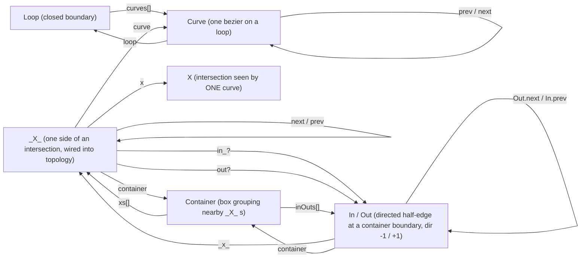

# Core data structures & their relationships

This document maps the main data structures used throughout the boolean engine
and the references (edges) that connect them. Every edge below is an actual
field on the structure; `[]` denotes an array/collection of references.

Source of truth (interfaces):

- `Loop`       — `src/shape/loop.ts`
- `Curve`      — `src/curve/curve.ts`
- `X`          — `src/get-critical-points/x.ts`
- `_X_`        — `src/get-critical-points/-x-.ts`
- `Container`  — `src/containers/container.ts`
- `In` / `Out` — `src/containers/in-out/in-out.ts`

---

## Directed reference graph

Each arrow is a field pointing from the owner to the referenced structure. Solid
arrows are the primary "owns / points at" references; the labels are the field
names. `In` and `Out` share the `InOut` base, so they are drawn as one node with
the direction-specific fields noted.



---

## Same graph as plain text

For viewing without any Mermaid renderer. Each structure lists its fields that
reference another structure: `field ► Target`. `↺` = self-reference (points at
another instance of the same type), `[]` = array/collection, `?` = optional.

```text
Loop
  curves[]                  ► Curve
  (idx, beziers — no refs)

Curve
  loop                      ► Loop        (back-ref)
  prev / next               ► Curve       ↺
  (idx, ps — no refs)

_X_  — one side of an intersection
  x                         ► X
  curve                     ► Curve
  container                 ► Container
  next / prev               ► _X_         ↺  (loop order)
  in_?                      ► In
  out?                      ► Out

X  — pure geometry (ri, kind, p) — no outgoing refs

Container
  xs[]                      ► _X_
  inOuts[]                  ► In | Out
  (box, bigBox — no refs)

In / Out  — dir = -1 (In) / +1 (Out)
  _x_                       ► _X_
  container                 ► Container
  prevAround / nextAround   ► In | Out    ↺  (around container)
  parent                    ► Out         ↺  (nesting tree)
  children (Set)            ► Out         ↺  (nesting tree)
  path[]                    ► In | Out    ↺  (face boundary)
  Out.next                  ► In             (crossing pair)
  In.prev                   ► Out            (crossing pair)
```

---

## What each structure is

### `Loop`
A closed, two-way linked ring of `Curve`s that describes one input sub-path
(the outer boundary of a shape or a hole).

| field     | type            | points at | meaning |
|-----------|-----------------|-----------|---------|
| `curves`  | `Curve[]`       | Curve     | the curves forming this boundary |
| `beziers` | `number[][][]`  | —         | the same curves as raw bezier control points |
| `idx`     | `number`        | —         | loop identifier |

### `Curve`
One bezier curve on a loop. Curves are cyclically linked via `prev`/`next` and
know the `Loop` they belong to.

| field  | type         | points at | meaning |
|--------|--------------|-----------|---------|
| `idx`  | `number`     | —         | ordered index within the loop (imposes cyclic order) |
| `ps`   | `number[][]` | —         | bezier control points |
| `loop` | `Loop`       | Loop      | owning loop (back-reference) |
| `prev` | `Curve`      | Curve     | previous curve (negative direction) |
| `next` | `Curve`      | Curve     | next curve (positive direction) |

### `X`
An intersection point **as seen by one of the two curves** involved. A full
intersection is a *pair* of `X`s (one per curve). Pure geometry — carries the
root interval, kind and point, but no topology links.

| field         | type              | meaning |
|---------------|-------------------|---------|
| `ri`          | `RootInterval`    | tight `t` interval (`{ tS, tE, multiplicity }`) |
| `kind`        | `0..8`            | intersection kind (min-y=0, curve-curve=1, self=2, cusp=3, interface=4, overlap=5, point=6, curvature=7, tangent=8) |
| `p`           | `number[]`        | the intersection point |
| `compensated?`| `number`          | times the root was compensated |
| `riExp?`      | `RootIntervalExp` | compensated root interval |
| `getPExact?`  | `() => number[][]`| exact point accessor |

### `_X_`
One side of an intersection **wired into the topology**. This is the hub that
ties geometry (`X`, `Curve`) to the arrangement (`Container`, `In`/`Out`) and to
the loop-ordered chain of intersections (`next`/`prev`).

| field           | type          | points at | meaning |
|-----------------|---------------|-----------|---------|
| `x`             | `X`           | X         | the geometric intersection this side sees |
| `curve`         | `Curve`       | Curve     | the curve this side lies on |
| `container`     | `Container`   | Container | the box grouping this intersection |
| `next` / `prev` | `_X_`         | _X_       | next/prev intersection along the original loop |
| `in_?`          | `In`          | In        | the entry half-edge (if this is a run entry) |
| `out?`          | `Out`         | Out       | the exit half-edge (if this is a run exit) |

### `Container`
A small rectangular box that groups nearby intersections (all `_X_`s inside are
"far" from the box sides). Holds the boundary-ordered `In`/`Out` half-edges used
by the tracer.

| field     | type          | points at | meaning |
|-----------|---------------|-----------|---------|
| `xs`      | `_X_[]`       | _X_       | intersections enclosed by this box |
| `box`     | `number[][]`  | —         | the enclosing box |
| `bigBox`  | `number[][]`  | —         | box used to order the `InOut`s |
| `inOuts`  | `(In\|Out)[]` | In/Out    | half-edges, ordered anti-clockwise from the (min-y, max-x) corner |

### `In` / `Out` (`InOut`)
A directed half-edge where a curve crosses a container boundary: `Out` (`dir
= +1`) leaves, `In` (`dir = -1`) enters. Two `InOut`s with the same `idx` form
a pair. When an `InOut` also represents a traced loop (a face boundary) it
carries the arrangement/nesting fields (`orientation`, `windingNum`, `parent`,
`children`, `path`).

| field                     | type          | points at | meaning |
|---------------------------|---------------|-----------|---------|
| `idx`                     | `number`      | —         | pair id (shared by the In and Out of a crossing) |
| `_x_`                     | `_X_`         | _X_       | the intersection side this half-edge is at |
| `container`               | `Container`   | Container | owning container |
| `prevAround` / `nextAround` | `In\|Out`   | In/Out    | neighbour anti-clockwise around the container boundary |
| `orientation`             | `number`      | —         | +1 / -1 (only when it represents a loop) |
| `windingNum`              | `number`      | —         | winding of the face just inside this loop |
| `parent`                  | `Out`         | Out       | enclosing loop in the nesting tree |
| `children`                | `Set<Out>`    | Out       | directly nested loops |
| `path`                    | `(In\|Out)[]` | In/Out    | the half-edges forming this traced face boundary |
| `Out.next`                | `In`          | In        | the paired `In` continuing the trace |
| `In.prev`                 | `Out`         | Out       | the paired `Out` preceding in the trace |

---

## Reading the graph by concern

- **Geometry / input:** `Loop` → `Curve` (`prev`/`next` ring) → raw beziers.
  `Curve.loop` closes the back-reference.
- **Intersections:** each crossing is a pair of `X` (per-curve geometry) wrapped
  by `_X_`, which links back to its `Curve` and forward to its `Container`.
- **Loop order of crossings:** follow `_X_.next` / `_X_.prev` to walk
  intersections in the order they occur along the original loop.
- **Spatial grouping:** `Container.xs` collects the `_X_`s in a box;
  `Container.inOuts` are the directed half-edges on that box's boundary.
- **Arrangement / tracing:** `In`/`Out` half-edges connect via `nextAround`
  (around a container) and `Out.next` / `In.prev` (paired crossing); traced
  faces form the nesting tree through `parent` / `children`, with the face's
  own boundary in `path`.
